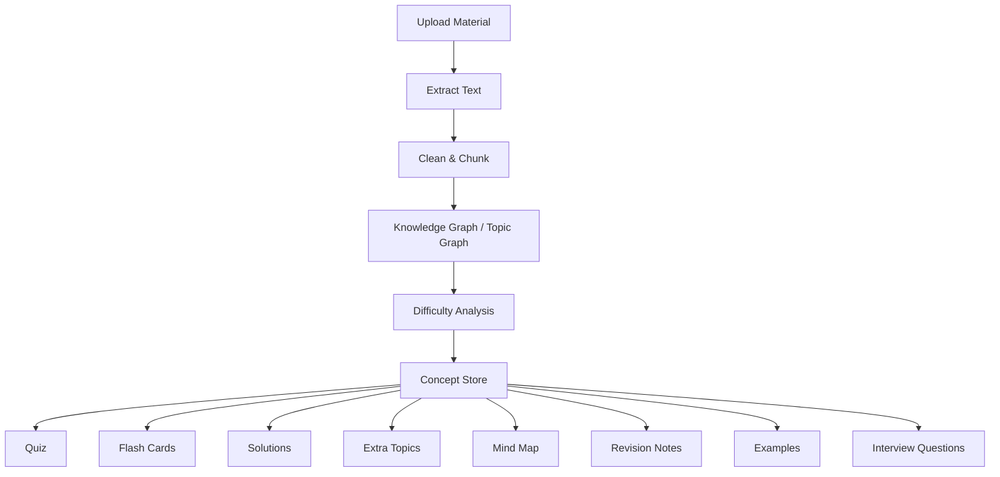
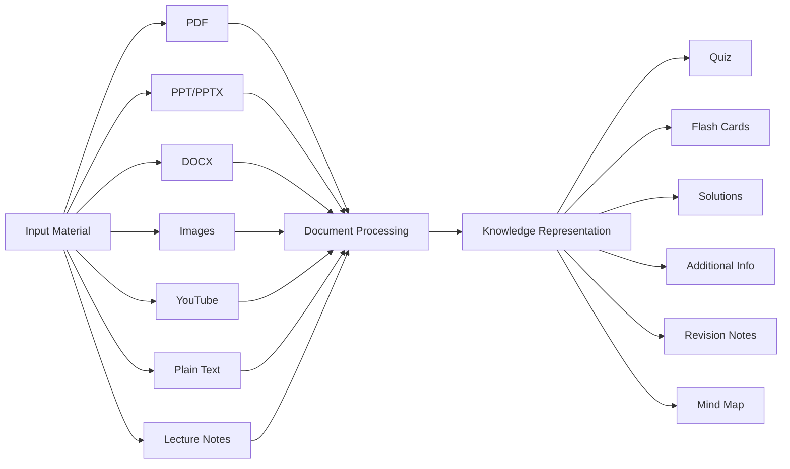
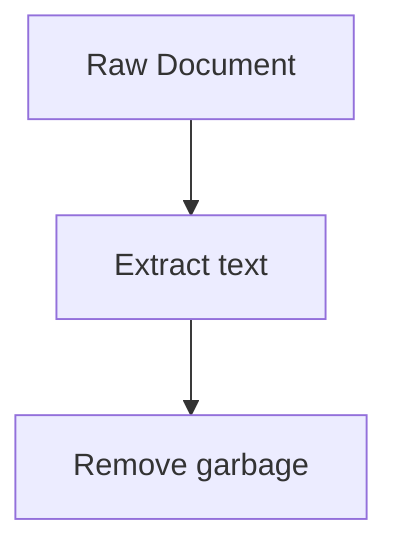
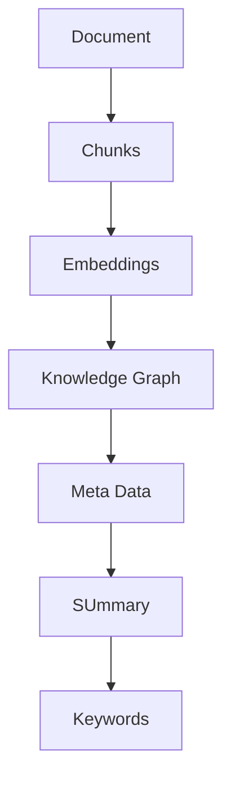
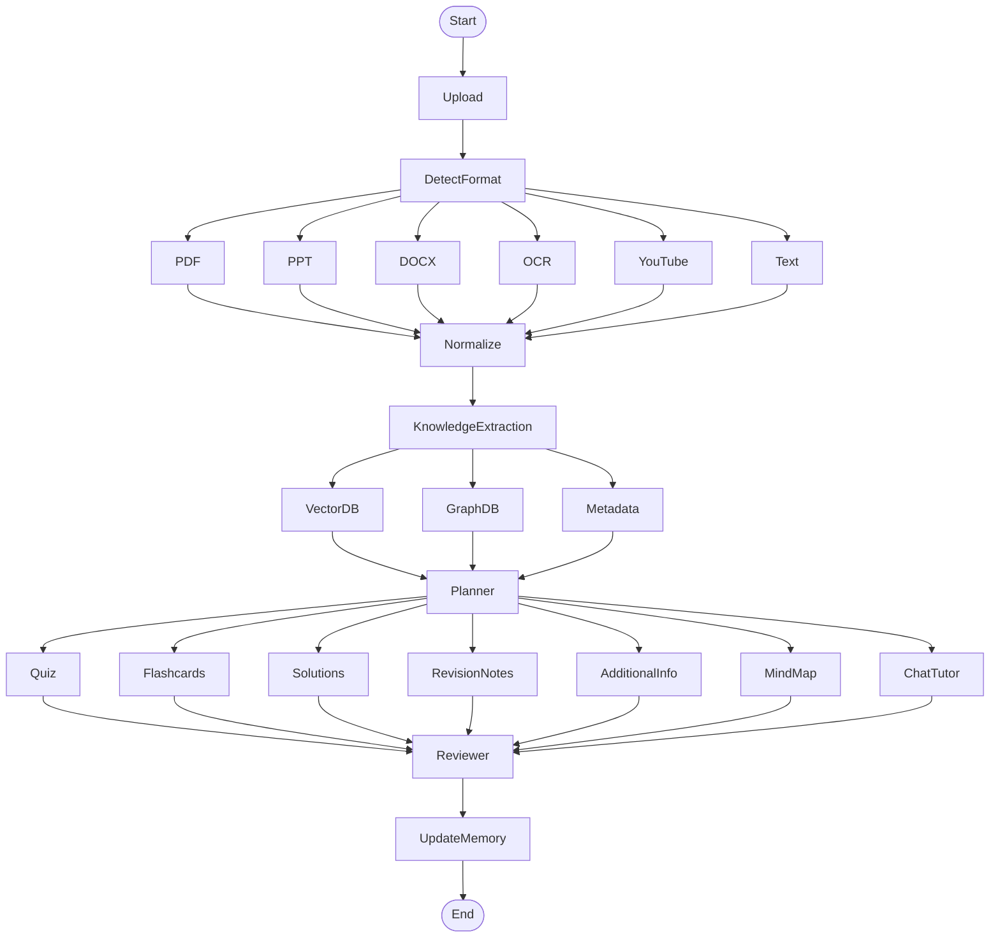

Problem: Need an webapp for faster learning just with material.
Solution: Building an webapp with LLM and python function

Important features:
- Quiz
- Flash Cards
- Solution (size depends on the marks)
- Additional information about the topic


### Pipeline: 



Expected input and output:


### phase - 1 : Input layer format needs

| **Input**     | **Loader**                             |
| ------------- | -------------------------------------- |
| PDF           | PyMuPDF / pdfplumber                   |
| PPT           | python-pptx                            |
| DOCX          | python-docx                            |
| Images        | OCR (Tesseract, PaddleOCR, GPT Vision) |
| YouTube       | Transcript API / Whisper               |
| Plain Text    | Direct                                 |
| Lecture Notes | Markdown/Text parser                   |
### phase - 2 : Document Understanding

This is where LangChain gets into play.

here is the pipeline for that ->



### Phase - 3 : Knowledge Extraction

Important aspect:
- Topics
- Subtopics
- Definitions
- Formulae
- Examples
- Important Dates
- People
- Concept Relationships
- Difficulty
- Prerequisites

### Phase - 4 : Store it

Instead of storing only embeddings...

Store multiple representations.


Example metadata: (or it can be better)
```
{
  "chapter": "Sorting",
  "difficulty": "Medium",
  "estimated_time": "15 mins",
  "concepts": [
    "Merge Sort",
    "Quick Sort",
    "Heap Sort"
  ]
}
```

### Phase - 5: Planner (LangGraph)

what the graph asks:
```
What does the user want?

↓

Quiz?

↓

Flashcards?

↓

Notes?

↓

Explain?

↓

Compare?

↓

Roadmap?
```

planner chooses the workflow.

### Phase - 6: Specialized Workflows

#### Quiz Graph

```
Retrieve Concepts

↓

Choose Difficulty

↓

Generate Questions

↓

Generate Answers

↓

Generate Explanation

↓

Review
```

---

#### Flashcard Graph

```
Retrieve Concepts

↓

Generate Card

↓

Generate Hint

↓

Generate Mnemonic

↓

Generate Related Topics
```

---

#### Solution Graph

```
Retrieve Topic

↓

Read Marks

↓

Choose Depth

↓

Generate Solution

↓

Review
```

---

#### Additional Info Graph

```
Topic

↓

Applications

↓

Industry Uses

↓

History

↓

Common Mistakes

↓

Interview Questions
```

### Phase - 7 : User Learning Memory

This is where LangGraph becomes powerful.

```
User

↓

Quiz

↓

Score = 45%

↓

Weak Topics Updated

↓

Next Quiz Generated

↓

Difficulty Increased

↓

Mastery Updated
```

State could look like

```
class LearningState:
    uploaded_material
    extracted_topics
    completed_topics
    weak_topics
    strong_topics
    quiz_history
    flashcards_generated
    revision_history
    learning_goal
```

## Multi-Agent Design

Instead of one huge prompt:

```
Planner Agent
```

decides

↓

```
Document Agent
```

extracts knowledge

↓

```
Teacher Agent
```

explains

↓

```
Examiner Agent
```

creates quizzes

↓

```
Reviewer Agent
```

checks quality

↓

```
Memory Agent
```

updates progress


---

### A More Scalable LangGraph



---

## Technology Stack

| Layer           | Suggested Tools                         |
| --------------- | --------------------------------------- |
| UI              | React / Next.js                         |
| Backend API     | FastAPI                                 |
| Workflow        | LangGraph                               |
| LLM Components  | LangChain                               |
| Observability   | LangSmith                               |
| OCR             | PaddleOCR or GPT Vision                 |
| Embeddings      | OpenAI, Voyage AI, or BAAI BGE          |
| Vector DB       | Chroma (dev), Qdrant or Pinecone (prod) |
| Knowledge Graph | Neo4j (optional)                        |
| Database        | PostgreSQL                              |
| Storage         | S3 / Supabase Storage / Local           |
| Background Jobs | Celery or FastAPI Background Tasks      |

## One architectural suggestion

Avoid building separate "Quiz Generator", "Flashcard Generator", etc., that each re-read the uploaded material. Instead, process the material **once** into a canonical knowledge base (concepts, summaries, metadata, embeddings, relationships). Every feature should read from that knowledge base. This reduces cost, improves consistency across outputs, and makes it much easier to add new features like AI tutoring, revision plans, concept maps, or adaptive learning later without changing the ingestion pipeline.