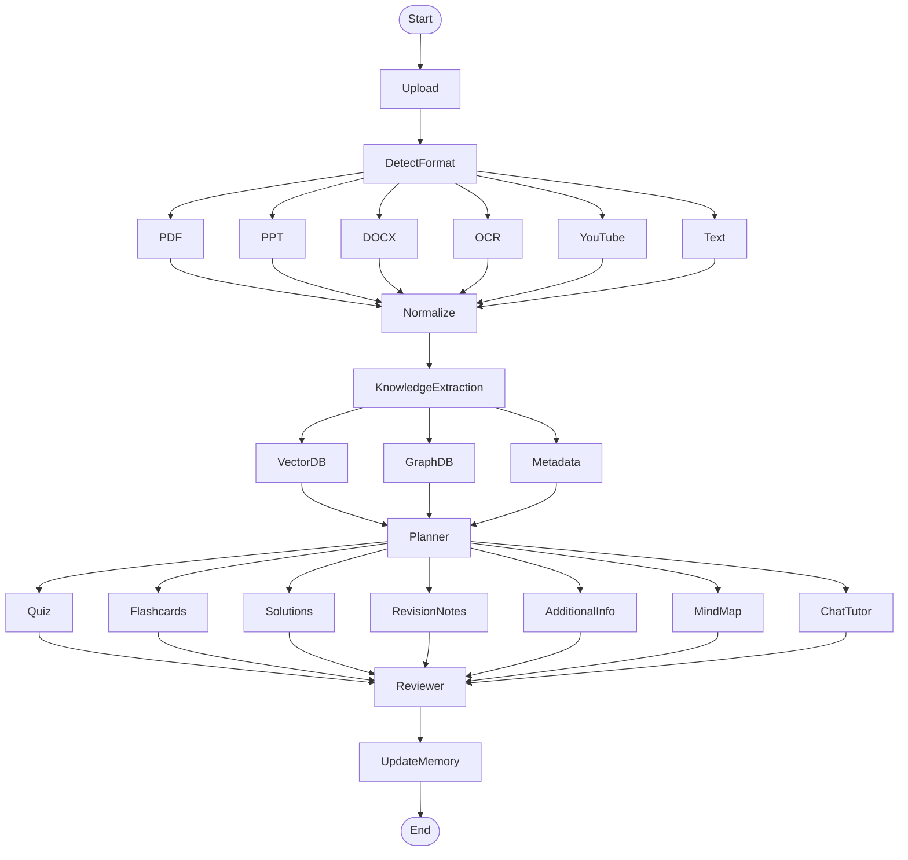

# NeuroForge — Adaptive Learning Engine

## Overview

NeuroForge is an intelligent learning platform that transforms raw study material into structured, personalized learning experiences. Upload any document — PDF, PPT, DOCX, images, YouTube links, or plain text — and NeuroForge builds a knowledge graph, then generates quizzes, flashcards, solutions, revision notes, mind maps, and more, all adapted to your learning progress.

---

## Core Idea

Process material **once** into a canonical knowledge base (concepts, summaries, metadata, embeddings, relationships). Every feature reads from that knowledge base — no redundant re-processing.

---

## Features

- **Quiz Generation** — difficulty-aware, with explanations
- **Flashcards** — with hints, mnemonics, and related topics
- **Solutions** — depth scales with marks/weight
- **Revision Notes** — concise, structured summaries
- **Mind Maps** — visual concept relationships
- **Additional Info** — applications, history, industry uses, interview questions
- **Adaptive Learning** — tracks weak/strong topics, adjusts difficulty over time
- **Chat Tutor** — conversational Q&A grounded in your material

---

## Architecture



---

## Pipeline Phases

### Phase 1 — Input Layer

| Input | Loader |
|-------|--------|
| PDF | PyMuPDF / pdfplumber |
| PPT/PPTX | python-pptx |
| DOCX | python-docx |
| Images | OCR (PaddleOCR / GPT Vision) |
| YouTube | Transcript API / Whisper |
| Plain Text | Direct |
| Lecture Notes | Markdown/Text parser |

### Phase 2 — Document Understanding

Raw Document → Extract Text → Clean & Remove Garbage → Normalize

### Phase 3 — Knowledge Extraction

Extracts: Topics, Subtopics, Definitions, Formulae, Examples, Important Dates, People, Concept Relationships, Difficulty Levels, Prerequisites.

### Phase 4 — Knowledge Store

Multiple representations stored — not just embeddings:

```
Document → Chunks → Embeddings → Knowledge Graph → Metadata → Summary → Keywords
```

Example metadata:

```json
{
  "chapter": "Sorting",
  "difficulty": "Medium",
  "estimated_time": "15 mins",
  "concepts": ["Merge Sort", "Quick Sort", "Heap Sort"]
}
```

### Phase 5 — Planner (LangGraph)

Routes user intent to the appropriate specialized workflow (Quiz, Flashcards, Notes, Explain, Compare, Roadmap).

### Phase 6 — Specialized Workflows

Each output type has its own generation graph (retrieve → generate → review).

### Phase 7 — User Learning Memory

Tracks quiz scores, weak/strong topics, mastery levels. Adapts future content generation accordingly.

---

## Multi-Agent Design

| Agent | Role |
|-------|------|
| Planner Agent | Decides what workflow to trigger |
| Document Agent | Extracts and structures knowledge |
| Teacher Agent | Explains concepts |
| Examiner Agent | Creates quizzes and assessments |
| Reviewer Agent | Checks output quality |
| Memory Agent | Updates user learning progress |

---

## Technology Stack

| Layer | Tools |
|-------|-------|
| UI | React / Next.js |
| Backend API | FastAPI |
| Workflow | LangGraph |
| LLM Components | LangChain |
| Observability | LangSmith |
| OCR | PaddleOCR / GPT Vision |
| Embeddings | OpenAI / Voyage AI / BAAI BGE |
| Vector DB | Chroma (dev), Qdrant or Pinecone (prod) |
| Knowledge Graph | Neo4j (optional) |
| Database | PostgreSQL |
| Storage | S3 / Supabase Storage / Local |
| Background Jobs | Celery / FastAPI Background Tasks |

---

## Project Status

- **Prototype-1**: Python backend + Streamlit UI (current phase)
- **Prototype-2**: Flutter mobile app (planned)

---

## Getting Started

```bash
# Clone and enter
cd NeuroForge

# Create virtual environment
python -m venv .venv
.venv\Scripts\activate   # On Windows
# source .venv/bin/activate  # On Linux/Mac

# Install dependencies
pip install -r requirements.txt

# Run the API server
uvicorn main:app --reload
```

The API will be available at `http://localhost:8000`. Interactive documentation at `http://localhost:8000/docs`.

---

## API Endpoints

### Core Endpoints

| Endpoint | Method | Description |
|----------|--------|-------------|
| `/` | GET | API info |
| `/health` | GET | Health check |
| `/stats` | GET | Knowledge base & learning stats |
| `/process` | POST | Multi-agent orchestrator (auto-routes queries) |

### Document Ingestion

| Endpoint | Method | Description |
|----------|--------|-------------|
| `/upload` | POST | Upload document (PDF, PPTX, DOCX, images) |
| `/upload/youtube` | POST | Process YouTube video transcript |

### Content Generation

| Endpoint | Method | Description |
|----------|--------|-------------|
| `/quiz` | POST | Generate quiz questions |
| `/flashcards` | POST | Generate flashcards |
| `/notes` | POST | Generate revision notes |
| `/solution` | POST | Generate structured solution |
| `/mindmap` | POST | Generate mind map |
| `/additional-info` | POST | Generate applications, interview Q's, etc. |

### Chat Tutor

| Endpoint | Method | Description |
|----------|--------|-------------|
| `/chat` | POST | Chat with AI tutor |
| `/chat/{session_id}` | DELETE | Reset chat session |

### Learning Progress

| Endpoint | Method | Description |
|----------|--------|-------------|
| `/progress` | GET | Overall learning progress |
| `/progress/{topic}` | GET | Topic-specific progress |
| `/progress/score` | POST | Record quiz score |

### Spaced Repetition

| Endpoint | Method | Description |
|----------|--------|-------------|
| `/spaced-repetition/due` | GET | Get due flashcards |
| `/spaced-repetition/review` | POST | Submit card review |
| `/spaced-repetition/card/{id}` | GET | Get card stats |

### Search

| Endpoint | Method | Description |
|----------|--------|-------------|
| `/search` | GET | Search knowledge base (semantic/hybrid) |

---

## Quick API Examples

### Generate a Quiz
```bash
curl -X POST http://localhost:8000/quiz \
  -H "Content-Type: application/json" \
  -d '{"topic": "Python basics", "num_questions": 5}'
```

### Chat with Tutor
```bash
curl -X POST http://localhost:8000/chat \
  -H "Content-Type: application/json" \
  -d '{"message": "Explain recursion"}'
```

### Upload a Document
```bash
curl -X POST http://localhost:8000/upload \
  -F "file=@my_notes.pdf"
```

### Use Multi-Agent Orchestrator
```bash
curl -X POST http://localhost:8000/process \
  -H "Content-Type: application/json" \
  -d '{"query": "Create flashcards about machine learning"}'
```

---

## License

MIT
