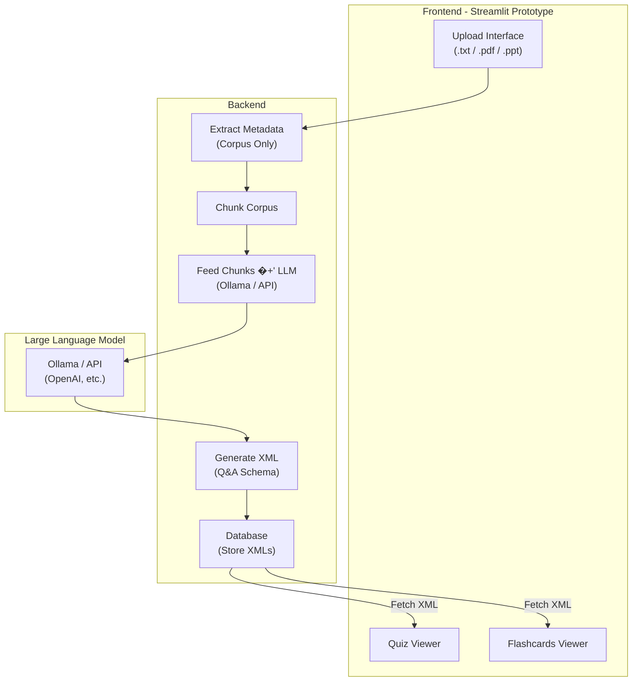

# Flashcards & Quiz Generator (Prototype-1)

## Overview
This project is a **lightweight prototype** that extracts text from multiple formats (`.txt`, `.pdf`, `.ppt`), processes the corpus through an LLM (Ollama or API), and generates structured **XML files** containing quizzes and flashcards.  

The generated XMLs are stored in a backend database and served to a **Streamlit frontend** for interactive visualization.

---

## Tech Stack
- **Language:** Python  
- **Frontend:** Streamlit (Prototype UI)  
- **Backend:** Python services + Database  
- **Database:** Any lightweight DB (SQLite/PostgreSQL) to store XMLs  
- **LLM:** Ollama (local) or external API (OpenAI, etc.)  

---

## Architecture

## Prototype-1: Reference Folder

The `reference/` directory is strictly a developer sandbox that showcases experimental scripts for working with different APIs before they are integrated into the production-ready prototype. Explore the files inside to understand how we authenticate, send requests, and process responses when exercising external services.

**Currently demonstrated APIs and helpers**
- OpenRouter chat completions via direct `requests` calls.
- Groq LLM interactions using the official `groq` client.
- GitHub Models (Azure AI Inference) chat completions with `azure-ai-inference` and `azure-core`.

**Reference-specific dependencies**
The scripts rely on libraries tracked in `reference/requirements.txt`, including `azure-ai-inference`, `azure-core`, `groq`, `python-dotenv`, and `requests`. Install them only if you plan to experiment inside the reference workspace.

> The reference folder is disconnected from the Prototype-1 runtime—removing or modifying these helpers will not impact the Streamlit app.

> Prototype-2 will be implemented in Flutter for mobile usage.
